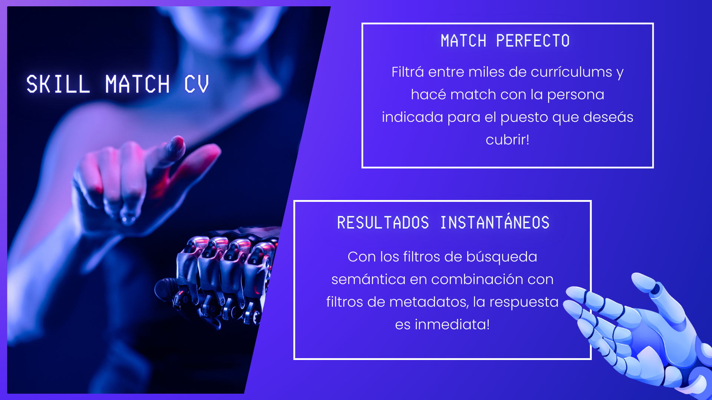
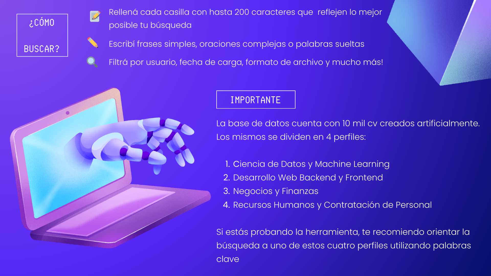
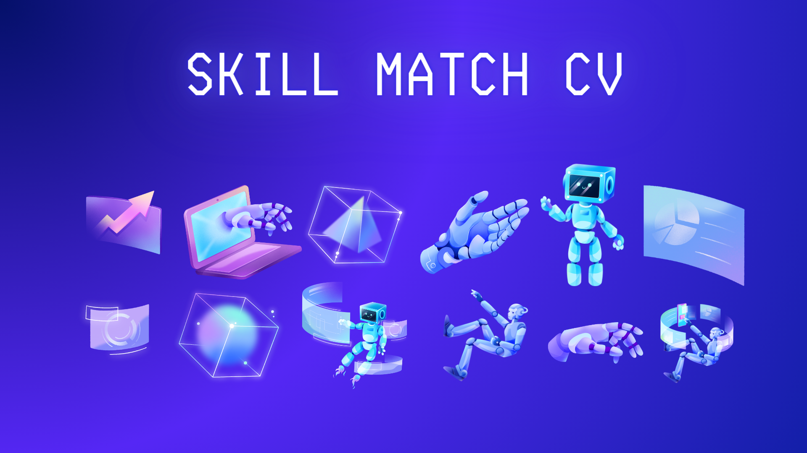

# SkillMatchCV - Plataforma de Búsqueda de Currículums

## Descripción

SkillMatchCV es un proyecto que combina la generación de currículums sintéticos, la creación de una base de datos vectorial en Pinecone con metadatos y una aplicación web interactiva desarrollada con Streamlit. Esta plataforma está diseñada para ayudarte a encontrar los currículums más relevantes y similares semánticamente a un puesto de trabajo específico.

## Estructura del Proyecto

El proyecto SkillMatchCV está organizado en tres carpetas principales:

### 1. CreadorCV

En la carpeta "CreadorCV" encontrarás el proceso de creación de currículums sintéticos. Este proceso utiliza Python y genera currículums de ejemplo con información ficticia. Además, la carpeta contiene la documentación detallada que explica cada paso del proceso. Los currículums generados son utilizados como datos de prueba para la plataforma.

### 2. CreadorDB

La carpeta "CreadorDB" se encarga de la creación de una base de datos vectorial en Pinecone con metadatos. Esta base de datos almacena los currículums generados y sus vectores asociados. Además, se crea un archivo CSV que contiene un DataFrame de respaldo y seguimiento de archivos cargados. Esto permite gestionar y consultar los currículums de manera eficiente.

### 3. Streamlit

La carpeta "Streamlit" contiene la aplicación web desarrollada con Streamlit. La aplicación proporciona una interfaz para consultar currículums a través de palabras clave y filtros de metadatos. Los usuarios pueden buscar currículums similares semánticamente al puesto que desean cubrir. Para acceder a la aplicación, se puede visitar [skillmatchcv.streamlit.app](https://skillmatchcv.streamlit.app) y utilizar las siguientes credenciales:

- Usuario: usuario1
- Clave: clave1

## Indicaciones para una Búsqueda Efectiva

Para realizar búsquedas efectivas en la plataforma, tener en cuenta las siguientes recomendaciones:

- Otorgar mayor relevancia a las palabras clave en las consultas. Repetir palabras clave puede aumentar la precisión de los resultados.
- Por ejemplo, en la consulta "Desarrollador en Python con conocimientos en TensorFlow y herramientas de Python avanzado (TensorFlow, Keras, PyTorch, Seaborn)", la repetición de "Python" y "TensorFlow" aumentará las posibilidades de encontrar currículums más similares semánticamente y destacará esas palabras dentro del contexto.

## Uso de la Plataforma

SkillMatchCV es de consulta abierta, y puedes acceder a través de [skillmatchcv.streamlit.app](https://skillmatchcv.streamlit.app) con las credenciales proporcionadas. La plataforma te ayudará a encontrar el candidato ideal para el puesto que necesitas cubrir.

¡Esperamos que SkillMatchCV sea una herramienta valiosa en tu búsqueda de talento!

---
## Licencia y Contacto

El proyecto se distribuye bajo la licencia MIT, lo que significa que es de código abierto y se puede utilizar y modificar libremente. Si tienes alguna pregunta o sugerencia, no dudes en ponerte en contacto.

* Linkedin: [Jeremías Pombo](https://www.linkedin.com/in/jeremiaspombo/)
* GitHub: [GitHub](https://github.com/Jeremias44)
* Correo electrónico: jeremiaspombo@outlook.com

